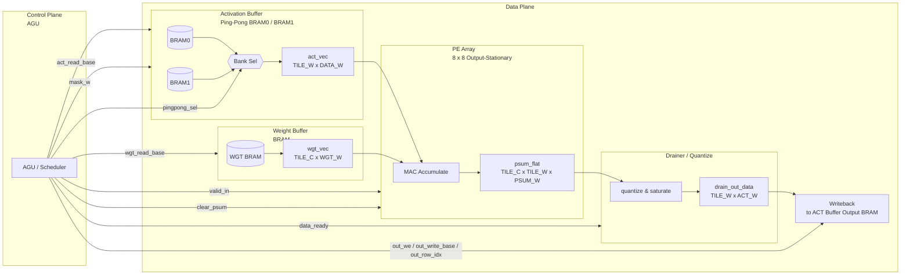
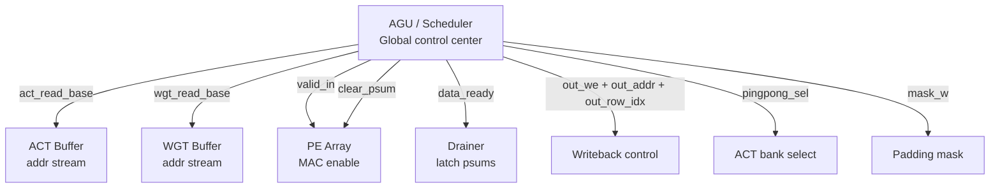
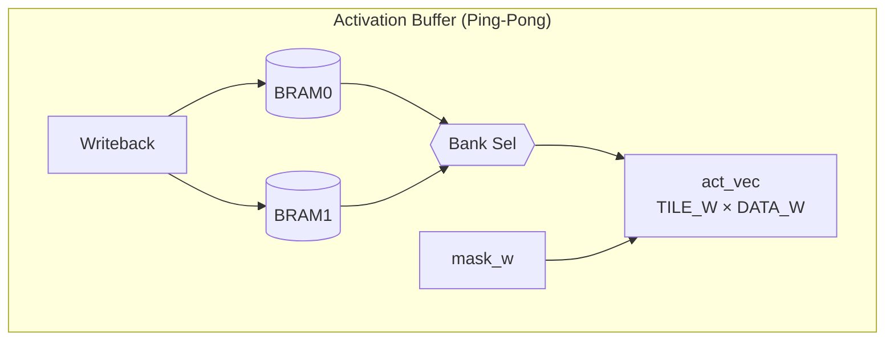
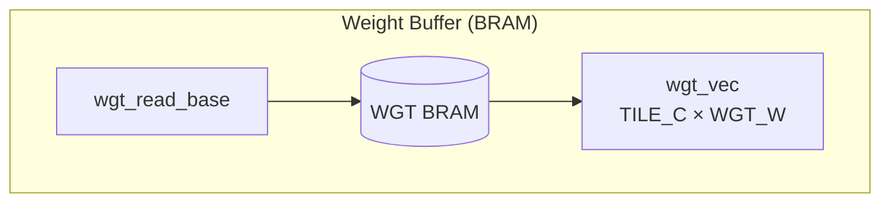
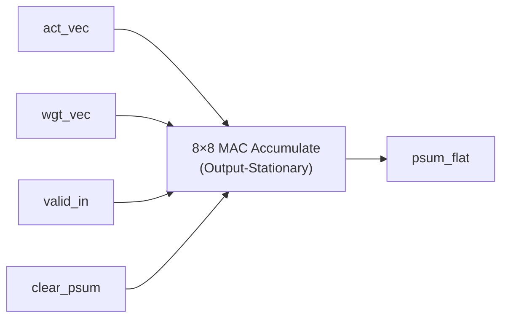

---
# try also 'default' to start simple
theme: seriph
# random image from a curated Unsplash collection by Anthony
# like them? see https://unsplash.com/collections/94734566/slidev
background: https://cover.sli.dev
# some information about your slides (markdown enabled)
title: FPGA Final Report
author: Liu Hanzuo. Liu Kehan
info: |
  ## Slidev Starter Template
  Presentation slides for developers.

  Learn more at [Sli.dev](https://sli.dev)
# apply UnoCSS classes to the current slide
class: text-center
# https://sli.dev/features/drawing
drawings:
  persist: false
# slide transition: https://sli.dev/guide/animations.html#slide-transitions
transition: slide-left
# enable MDC Syntax: https://sli.dev/features/mdc
mdc: true
# duration of the presentation
duration: 20min
---

# FPGA Final Report

"An Output Stationary CNN on FPGA"

<div @click="$slidev.nav.next" class="mt-12 py-1" hover:bg="white op-10">
  Get Started <carbon:arrow-right />
</div>

<div class="abs-br m-6 text-xl">
  <a href="https://github.com/liuhanzuo/The-World-Fastest-CNN-Using-FPGA" target="_blank" class="slidev-icon-btn">
    <carbon:logo-github />
  </a>
</div>

<!--
The last comment block of each slide will be treated as slide notes. It will be visible and editable in Presenter Mode along with the slide. [Read more in the docs](https://sli.dev/guide/syntax.html#notes)
-->

---
transition: fade-out
---

# FPGA Structure

Our design basically contains 5 parts

- 📝 **PE Array** - An 8×8 output-stationary processing-element array integrated with on-chip BRAM interfaces.
- 🎨 **Activation Buffer** - A ping-pong (double-buffered) activation store that alternates between holding the current layer’s inputs and receiving the computed outputs.
- 🧑‍💻 **Weight Buffer** - A BRAM-backed, sequential weight storage module that streams convolution kernel weights to the compute fabric.
- 🤹 **Address Generation Unit(AGU)** - The central control unit that implements cycle-level scheduling and address generation, and issues key control handshakes (e.g., DATA_READY) to coordinate data movement and computation across the system.
- 🎥 **TOP Module** - A top-level wrapper that instantiates and connects all submodules into a complete, end-to-end design.
<br>
<br>


<!--
You can have `style` tag in markdown to override the style for the current page.
Learn more: https://sli.dev/features/slide-scope-style
-->

<style>
h1 {
  background-color: #2B90B6;
  background-image: linear-gradient(45deg, #4EC5D4 10%, #146b8c 20%);
  background-size: 100%;
  -webkit-background-clip: text;
  -moz-background-clip: text;
  -webkit-text-fill-color: transparent;
  -moz-text-fill-color: transparent;
}
</style>

<!--
Here is another comment.
-->
---s

# Kernel Loop Nesting
```ts{all|1-5|6-11|12|13|all} 
TILE_C = 8, TILE_W = 8
For h0 = 0, h0 += 1:
  For base_c = 0, base_c += TILE_C:
    For base_w = 0, base_w += TILE_W:
      // Here we enter the 8*8 OS computation
      For ci = 0, ci += 1:
        For hk = - (HK - 1) / 2, hk += 1:
          For wk = - (WK - 1) / 2, wk += 1:
            For c0 = base_c, c0 += 1, c0 < base_c + TILE_C:
              For w0 = base_w + wk, w0 += 1, w0 < base_w + TILE_W + wk:
                // Here is a TILE_C x TILE_W PEs
                O[c0][h0][w0] += I[ci][h0 + hk][w0 + wk] * K[ci][hk][wk][c0]
// Each cycle read I[ci][h0+hk][base_w...base_w+TILE_W-1], K[ci][hk][wk][base_c...base_c+TILE_C-1]
```

---

# Architecture Walkthrough
```ts {all|all|all|1|2|3|4|5}
AGU
ACT Buffer
WGT Buffer
PE Array
Drainer
```
<div v-if="$slidev.nav.clicks === 1">

</div>
<div v-if="$slidev.nav.clicks === 2">

- AGU: global scheduler (addresses + control signals)
- Activation Buffer: ping-pong BRAM for feature maps
- Weight Buffer: BRAM for kernel weights
- PE Array: 8x8 output-stationary MAC
- Drainer: quantize + writeback
</div>
<div v-if="$slidev.nav.clicks === 3">


AGU: generates addresses + timing/control pulses (valid/data_ready/clear/writeback).Signals:

- act_read_base: base addr for reading activations
- wgt_read_base: base addr for reading weights
- ...
</div>
<div v-if="$slidev.nav.clicks === 4">

</div>

<div v-if="$slidev.nav.clicks === 5">

</div>

<div v-if="$slidev.nav.clicks === 6">

</div>

<div v-if="$slidev.nav.clicks === 7">

</div>

---

# Cycle-by-Cycle Walkthrough

```ts{all|all|all|all|all|all|all|all} 
CYCLE COUTING!
```

<div v-if="$slidev.nav.clicks === 0">

| Component   | Size       |
|-------------|------------|
| Wgt Buffer  | 1×5×5×32   |
| Act Buffer  | 1×32×32    |
| PE Array    | 8×8        |
| PE Drainer  | 8×8        |
| CYCLE       | 0  |

</div>
<div v-if="$slidev.nav.clicks === 1">

| Component   | Components       |
|-------------|------------|
| Wgt Buffer  | `wgt_addr[0][-2][-2][0]...wgt_addr[0][-2][-2][7]` |
| Act Buffer  | `act_addr[0][-2][-2]...act_addr[0][-2][5]`    |
| PE Array    | `clear_psum`        |
| PE Drainer  | X       |
| CYCLE       | 1  |

</div>
<div v-if="$slidev.nav.clicks === 2">

| Component   | Components       |
|-------------|------------|
| Wgt Buffer  | `wgt_addr[0][-2][-1][0]...wgt_addr[0][-2][-1][7]` |
| Act Buffer  | `act_addr[0][-2][-1]...act_addr[0][-2][6]`    |
| PE Array    | X       |
| PE Drainer  | X       |
| CYCLE       | 2  |

</div>
<div v-if="$slidev.nav.clicks === 3">

| Component   | Components       |
|-------------|------------|
| Wgt Buffer  | `wgt_addr[0][-2][0][0]...wgt_addr[0][-2][0][7]` |
| Act Buffer  | `act_addr[0][-2][0]...act_addr[0][-2][7]`    |
| PE Array    | X       |
| PE Drainer  | X       |
| CYCLE       | 3  |

</div>
<div v-if="$slidev.nav.clicks === 4">

| Component   | Components       |
|-------------|------------|
| Wgt Buffer  | `wgt_addr[0][2][2][0]...wgt_addr[0][2][2][7]` |
| Act Buffer  | `act_addr[0][2][2]...act_addr[0][2][9]`    |
| PE Array    | X       |
| PE Drainer  | X       |
| CYCLE       | N  |

Here N means where the data sending ends.
</div>
<div v-if="$slidev.nav.clicks === 5">

| Component   | Components       |
|-------------|------------|
| Wgt Buffer  | X |
| Act Buffer  | X    |
| PE Array    | `valid_in = 0`       |
| PE Drainer  | X       |
| CYCLE       | N + 1  |

Here N means where the data sending ends.
</div>
<div v-if="$slidev.nav.clicks === 6">

| Component   | Components       |
|-------------|------------|
| Wgt Buffer  | X |
| Act Buffer  | X    |
| PE Array    | X       |
| PE Drainer  | `data_ready`       |
| CYCLE       | N + 7  |

Here N means where the data sending ends.
</div>
<div v-if="$slidev.nav.clicks === 7">

| Component   | Components       |
|-------------|------------|
| Wgt Buffer  | X |
| Act Buffer  | X    |
| PE Array    | `clear_psum`       |
| PE Drainer  | X       |
| CYCLE       | N + 8  |

Clear psum and we are ready for the next tile.
</div>


---
class: text-center
---

# **Thanks For Listening**

Our code repository is shown here, please feel free to check it out!

- GitHub: [liuhanzuo/The-World-Fastest-CNN-Using-FPGA](https://github.com/liuhanzuo/The-World-Fastest-CNN-Using-FPGA)

<div class="mt-8">
  <a href="https://github.com/liuhanzuo/The-World-Fastest-CNN-Using-FPGA" class="px-6 py-3 border rounded bg-main text-white">View Source Code</a>
</div>